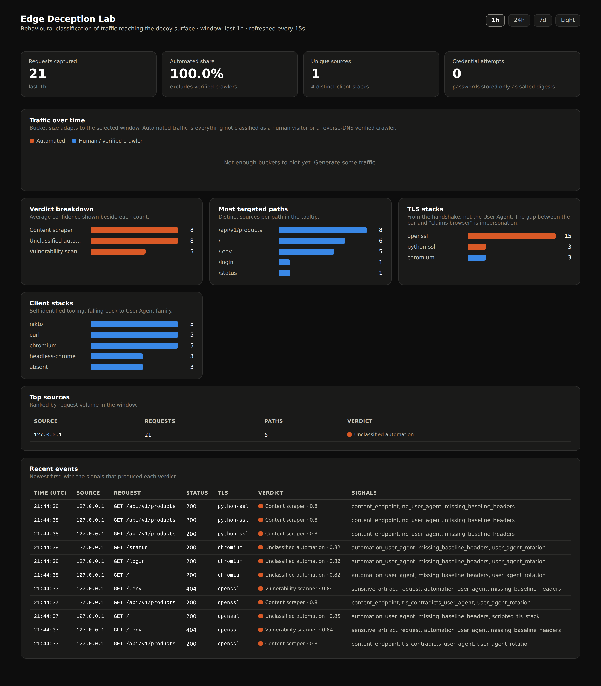

<h1 align="center">Edge Deception Lab</h1>

<p align="center">
  A honeypot that answers the question a WAF console never quite does:<br />
  <strong>who is actually hitting this application, and how would I have classified them?</strong>
</p>

<p align="center">
  
  
  
  
  
</p>

---

## What this is

A self-contained sensor that sits behind an edge layer, serves an inert decoy
application, and classifies every request that reaches it by **behaviour** rather
than by identity claim.

It is the mechanism behind a commercial bot-management product, rebuilt small
enough to read in one sitting: request fingerprinting, forward-confirmed reverse
DNS verification, velocity aggregation, weighted scoring, and an explainable
verdict for every single request.

I run Akamai environments for a living — WAF tuning, bot exceptions, Site Shield,
edge-to-origin troubleshooting. Operating a console teaches you *what* the
platform decided. Building the mechanism teaches you *why*, and where it breaks.
This repository is the second thing.



---

## The idea that shapes the design

Most honeypot projects collapse into a single question: "is this a bot?" That
question is not useful on its own, because the answer is almost always yes, and
because it merges two decisions that carry very different consequences.

This classifier keeps them apart:

| Axis | Question | Evidence |
|------|----------|----------|
| **Automation** | Is a human driving this? | Client-stack properties: header set, header order, `Sec-Fetch-*` metadata, Client Hints, TLS-adjacent tells |
| **Intent** | What is it trying to do? | Behaviour over time: path enumeration, exploit-shaped payloads, username rotation, catalogue iteration |

An uptime monitor scores high on automation and has no hostile intent. A
credential-stuffing run through a residential proxy pool may look almost like a
browser and still be an attack. Collapsing both into one score produces exactly
the class of false positive that gets a bot policy rolled back to alert-only —
so the two are scored separately, and the intent axis is what decides the
verdict.

### Verdicts

| Verdict | Meaning | Production analogue |
|---------|---------|---------------------|
| `verified_crawler` | Identity proven by forward-confirmed rDNS | Allowlist — never challenge |
| `vuln_scanner` | Enumerating artifacts or sending exploit-shaped payloads | Block |
| `credential_attack` | Authentication attempts with rotating usernames | Block + rate limit |
| `content_scraper` | Systematic content iteration, or a crawler impersonation | Challenge or tarpit |
| `recon_probe` | Touching administrative surface without a clear pattern yet | Monitor |
| `unclassified_automation` | Automated, intent not yet legible | **Alert only** |
| `likely_human` | Consistent browser fingerprint, low velocity | Allow |

`unclassified_automation` is deliberately a holding bucket rather than a
competitor to the intent verdicts. Moving a rule from alert to block is a
decision that needs evidence, and this is the queue where that evidence
accumulates.

### Every verdict carries its evidence

No score is emitted without the signals that produced it. This is not a
nice-to-have: a verdict you cannot explain is a verdict you cannot defend when a
customer opens a ticket asking why their integration was blocked.

```json
{
  "verdict": "vuln_scanner",
  "confidence": 0.83,
  "automation_score": 7.0,
  "human_score": 0.0,
  "signals": [
    {"name": "sensitive_artifact_request", "weight": 4.0, "detail": "/.env"},
    {"name": "path_enumeration",           "weight": 4.0, "detail": "70 paths"},
    {"name": "high_404_ratio",             "weight": 2.5, "detail": "95%"},
    {"name": "automation_user_agent",      "weight": 3.5, "detail": "nikto"}
  ]
}
```

---

## Architecture

```
                    ┌──────────────────────────────────────────┐
   internet ───────▶│  edge (nginx)                            │
                    │  · sets X-Edge-Client-IP unconditionally │
                    │  · rate limits                           │
                    │  · returns 404 for /_edl/*               │
                    └───────────────────┬──────────────────────┘
                                        │
                    ┌───────────────────▼──────────────────────┐
                    │  sensor (FastAPI)                        │
                    │                                          │
                    │  decoys ──▶ inert static responses       │
                    │  fingerprint ──▶ client-stack signals    │
                    │  enrich ──▶ forward-confirmed rDNS       │
                    │  storage ──▶ velocity aggregates         │
                    │  classifier ──▶ explainable verdict      │
                    └───────────────────┬──────────────────────┘
                                        │
                              SQLite (WAL) ──▶ /_edl/dashboard
```

Full design notes, including the threat model for the sensor itself, are in
[`docs/ARCHITECTURE.md`](docs/ARCHITECTURE.md).

---

## Running it

```bash
git clone https://github.com/amancio-g08/edge-deception-lab.git
cd edge-deception-lab

cp .env.example .env          # set EDL_CREDENTIAL_SALT to something unique
docker compose up --build -d

# generate synthetic traffic so there is something to look at
python tools/simulate_traffic.py --rounds 20 --simulate-edge

# dashboard (bound to loopback by design)
open http://127.0.0.1:8081/_edl/dashboard
```

`--simulate-edge` assigns each client profile a synthetic source address from
the RFC 5737 documentation ranges. Without it every profile shares one address
and the velocity aggregates collapse into a single client — which is also a
useful demonstration of the shared-IP problem the classifier has to survive.

### Without Docker

Everything except the nginx edge layer runs on Python alone:

```bash
pip install -r honeypot/requirements.txt
EDL_DB_PATH=./data/events.db python -m uvicorn honeypot.app.main:app --port 8080
python tools/simulate_traffic.py --target http://127.0.0.1:8080 --rounds 20 --simulate-edge
pytest -q
```

Then open `http://127.0.0.1:8080/_edl/dashboard`. Running the sensor directly
means no edge tier in front of it, so `X-Edge-Client-IP` is not overwritten —
fine for local work, never for anything exposed.

### Configuration

| Variable | Default | Purpose |
|----------|---------|---------|
| `EDL_DB_PATH` | `/data/events.db` | SQLite location |
| `EDL_CREDENTIAL_SALT` | `edge-deception-lab` | **Change this.** Salt for all stored digests |
| `EDL_VERIFY_BOT_RDNS` | `true` | Forward-confirmed rDNS for crawler verification |
| `EDL_VELOCITY_WINDOW` | `300` | Sliding window, in seconds, for velocity signals |
| `EDL_STORE_IP_RAW` | `true` | Set `false` to keep only the salted hash of source IPs |
| `EDL_PUBLIC_BIND` | `127.0.0.1` | Edge bind address — change only when deliberately exposing |

---

## Safety

This is a sensor, not a target. Three properties are enforced in code and pinned
by tests:

**Nothing exploitable.** Every decoy response is a static string. No template
rendering of user input, no path-driven file reads, no deserialization. The
login form always fails — a honeypot that grants access invites an attacker to
spend real effort inside it, which is a liability rather than a signal.

**No plaintext credentials.** Passwords, tokens, cookies and `Authorization`
headers are reduced to a salted SHA-256 digest before storage. Repeat attempts
still correlate; the operator never holds a usable credential harvested from a
third party. See `tests/test_redact.py` — if those tests fail, the lab is not
safe to run.

**Profiling is invisible.** The verdict never appears in a response header,
timing, or status code. A client that can detect it is being profiled will
change its behaviour, and the sensor stops being a sensor.

> **Before exposing this to the internet:** run it on an isolated host with no
> lateral access to anything you care about, set a unique `EDL_CREDENTIAL_SALT`,
> and check the abuse policy of your provider. Capturing traffic sent to your own
> infrastructure is one thing; where you host it, and what you then do with the
> data, is your responsibility — including under LGPD/GDPR, since source IPs are
> personal data. `EDL_STORE_IP_RAW=false` keeps only salted hashes.

---

## Known limitations

Stated plainly, because a security tool that hides its blind spots is worse than
one that has none.

- **IP is a weak identity.** Velocity aggregates key on the source address, so a
  CGNAT or corporate egress mixes many users into one profile. The username-rotation
  gate mitigates the worst case; identity built on the client fingerprint is on
  the roadmap.
- **No TLS fingerprinting yet.** JA4/JA3 lives below the reverse proxy and is the
  single strongest automation signal available. Until it lands, a client that
  perfectly reproduces browser headers is not distinguishable from a browser.
- **Thresholds are hand-tuned.** The weights come from reasoning about how these
  clients behave, validated against synthetic profiles and a false-positive
  regression suite — not from a labelled corpus.
- **rDNS verification is best-effort.** Lookups are cached and time-bounded; a
  resolver failure downgrades a legitimate crawler to unverified rather than
  failing open.

---

## Tests

```
33 passed
```

The suite is split by what it protects:

| File | Protects |
|------|----------|
| `test_classifier.py` | Verdicts for known-hostile behaviour |
| `test_false_positives.py` | Legitimate clients that naive rules would flag |
| `test_redact.py` | That no credential is ever stored in clear text |
| `test_capture.py` | End-to-end capture, and that profiling stays invisible |

---

## Roadmap

Development runs one branch per capability — see [`ROADMAP.md`](ROADMAP.md) for
what is planned and why.

---

## License

MIT — see [`LICENSE`](LICENSE).
